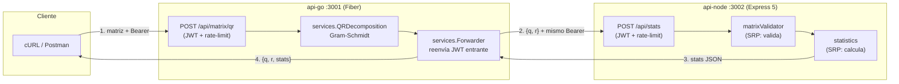
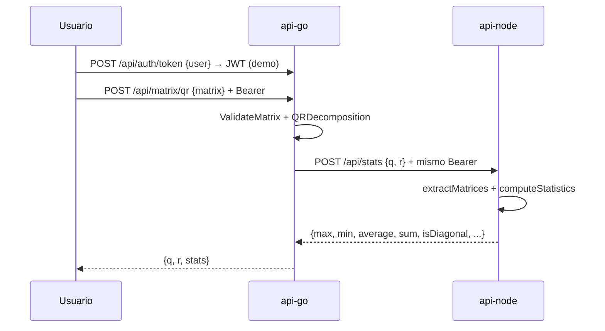

# Reto Técnico — Microservicios Go (Fiber) + Node.js (Express 5)

Dos microservicios comunicados por HTTP, protegidos con JWT compartido, contenedorizados y con tests.

| Servicio | Stack | Puerto local | Responsabilidad |
|---|---|---|---|
| `api-go` | Go 1.22 + Fiber v2 | `3001` | `POST /api/matrix/qr` (JWT): valida la matriz, calcula la **factorización QR** (Gram-Schmidt) y reenvía `{q, r}` a Node |
| `api-node` | Node 20 + Express 5 (ESM) | `3002` | `POST /api/stats` (JWT): recibe `{q, r}`, calcula **max, min, promedio, suma total y verificación de matriz diagonal** |

---

## Índice

1. [Arquitectura](#1-arquitectura)
2. [Organización del código](#2-organización-del-código)
3. [Principios SOLID y código limpio](#3-principios-solid-y-código-limpio)
4. [Modelo de seguridad](#4-modelo-de-seguridad)
5. [Referencia de endpoints](#5-referencia-de-endpoints)
6. [Variables de entorno](#6-variables-de-entorno)
7. [Ejecución local y con Docker](#7-ejecución-local-y-con-docker)
8. [Despliegue en Render (plan Free)](#8-despliegue-en-render-plan-free)
9. [Tests](#9-tests)
10. [Decisiones de diseño (ADRs-lite)](#10-decisiones-de-diseño-adrs-lite)

---

## 1. Arquitectura

### 1.1 Estilo

**Capas pragmáticas por servicio** (*layered-lite*): cada microservicio es un proceso independiente con su propio ciclo HTTP completo. No se usa Clean/Hexagonal con puertos y adaptadores porque no hay persistencia ni lógica de dominio intercambiable que lo justifique; en su lugar se aplica **inversión de dependencias puntual** (interfaces `QRService`/`StatsForwarder` en Go) donde aporta testabilidad.



### 1.2 Secuencia del flujo principal



Si Node está caído, Go responde `502` **sin ocultar** `q` y `r` (diseño fail-soft: el cálculo no se pierde).

---

## 2. Organización del código

```
reto-tecnico-node-go/
├── docker-compose.yml      # §7: red reto-net, healthchecks, env compartidas
├── render.yaml             # §8: Blueprint (2 web services free, sin compose)
├── .env.example            # plantilla de todas las variables (§6)
├── api-go/
│   ├── Dockerfile          # multi-stage golang:1.22-alpine → alpine:3.20
│   ├── go.mod
│   ├── main.go             # composition root: config, middlewares, DI, rutas
│   ├── config/config.go    # ÚNICA lectura de env + Validate() fail-fast
│   ├── middleware/auth.go  # JWT (secreto + issuer + audience)
│   ├── handlers/matrix.go  # Health, IssueToken (guard), NewQRHandler (inyecta DIP)
│   ├── models/types.go     # DTOs request/response
│   └── services/
│       ├── qr.go           # Gram-Schmidt (puro, sin I/O)
│       ├── validator.go    # ValidateMatrix + TooLargeError (413)
│       ├── forwarder.go    # POST a Node con timeout inyectable
│       ├── ports.go        # interfaces QRService / StatsForwarder (DIP)
│       ├── qr_test.go
│       └── validator_test.go
└── api-node/
    ├── Dockerfile          # node:20-alpine, usuario no-root, solo deps prod
    ├── package.json        # "type": "module", Express 5, vitest
    └── src/
        ├── index.js        # composition root: helmet, CORS, rate-limit, rutas
        ├── config.js       # ÚNICA lectura de env + validateConfig() fail-fast
        ├── middleware/auth.js  # JWT (secreto + issuer + audience)
        ├── routes/
        │   ├── stats.js    # POST /api/stats (protegido)
        │   └── auth.js     # POST /api/auth/token (guard demo)
        ├── services/
        │   ├── matrixValidator.js  # extrae + valida (SRP)
        │   ├── statistics.js       # calcula (SRP)
        │   └── __tests__/         # statistics, matrixValidator
        ├── middleware/__tests__/  # auth (401/exp/audience)
        └── utils/errors.js        # HttpError + errorHandler + notFound
```

**Reglas de dependencia entre capas** (nunca al revés):

- `routes/handlers` → `services` + `models`; jamás al contrario.
- `services` puros (QR, estadísticas, validador) **no conocen HTTP** ni variables de entorno: reciben todo por parámetros → testeables sin servidor.
- Solo `config.*` lee variables de entorno; solo `main/index` conecta implementaciones (composition root).

---

## 3. Principios SOLID y código limpio

| Principio | Dónde se aplica | Archivos |
|---|---|---|
| **S**RP | Validación separada del cálculo; errores centralizados | `matrixValidator(.js)` vs `statistics(.js)`; `validator.go` vs `qr.go`; `errors.js` / `ErrorHandler` |
| **O**CP | Nuevas validaciones o estadísticas se añaden sin modificar el handler | `statistics.js`, `validator.go` |
| **L**SP | Adaptadores-función (`QRServiceFunc`, `StatsForwarderFunc`) son sustituibles por la implementación real | `services/ports.go` |
| **I**SP | Interfaces mínimas de un solo método (`Decompose`, `Forward`) | `services/ports.go` |
| **D**IP | El handler Go depende de `QRService`/`StatsForwarder`, no de funciones concretas; el wiring vive en `main.go` | `handlers/matrix.go`, `main.go` |
| DRY | Una sola lectura de env por servicio; un solo formateador de errores | `config.js` / `config.go`, `errors.js` |
| Fail-fast | El arranque aborta en `production` con el secreto de ejemplo | `validateConfig()`, `config.Validate()` |
| Fail-soft | 502 con `q`/`r` incluidos si Node falla | `handlers/matrix.go` |

---

## 4. Modelo de seguridad

### 4.1 Qué se protege y cómo

| Capa | Mecanismo | Detalle |
|---|---|---|
| Autenticación | JWT HS256 **compartido** | Mismo `JWT_SECRET` + `JWT_ISSUER` + `JWT_AUDIENCE` en ambas APIs; Go reenvía el Bearer entrante a Node sin re-firmar |
| Autorización | Middleware Bearer en `/api/*` | Sin header → 401; esquema malformado → 401; firma/expiración/`iss`/`aud` inválidos → 401 |
| Cabeceras | `helmet` (Node) | CSP básica, HSTS, `X-Frame-Options`, `nosniff`, etc. |
| Abuso/DoS | Rate limit en `/api` (100 req/min por defecto) + tope de elementos (`MAX_MATRIX_ELEMENTS`, 413) + límite de body (1 MB) | `/health` queda **fuera** del rate limit para no romper probes |
| CORS | Restringible por `CORS_ORIGIN` | `*` solo para desarrollo local |
| Secretos | Nunca en código (salvo default local) + fail-fast en prod | `openssl rand -hex 32` para generarlos |
| Contenedores | Usuario no-root (Node), imagen mínima Alpine, red bridge dedicada | `Dockerfile` de cada servicio |

### 4.2 Supuestos y riesgos asumidos (honestidad técnica)

1. **`POST /api/auth/token` emite JWT sin credenciales**: es un emisor *demo* para el reto. En despliegues públicos poner `ENABLE_DEMO_TOKEN=false` (responde 404) y usar login real.
2. **HS256 con secreto compartido**: correcto para dos servicios propios; con más servicios o terceros, migrar a RS256/rotación.
3. **La red interna (compose) es de confianza**: sin mTLS entre Go y Node; aceptable en un bridge privado.
4. **Gram-Schmidt clásico** (no modificado): suficiente para el reto; para matrices grandes/mal condicionadas se preferiría Householder.

---

## 5. Referencia de endpoints

Base local: `http://localhost:3001` (Go), `http://localhost:3002` (Node). Todos responden errores como `{"error": "...", "code": NNN}`.

### `GET /health` (ambos, público)

- `200 {"status":"ok","service":"api-go"|"api-node"}` · Usado por healthchecks de Docker/Render.

### `POST /api/auth/token` (ambos, público salvo guard)

Request: `{"user": "demo"}` (`user` opcional). Response `200 {"token": "<JWT 2h, iss+aud>"}`.
Si `ENABLE_DEMO_TOKEN=false` → `404 {"error":"not found","code":404}`.

### `POST /api/matrix/qr` — Go (protegido)

Request:

```json
{ "matrix": [[1, 2], [3, 4], [5, 6]] }
```

Response `200`:

```json
{
  "q": [[-0.169, 0.897], [-0.507, 0.276], [-0.845, -0.345]],
  "r": [[5.916, 7.437], [0, 0.828]],
  "stats": { "max": 7.437, "min": -0.845, "average": 0.660, "sum": 7.257,
             "count": 11, "isDiagonal": false, "diagonalMatrix": null,
             "matricesAnalyzed": ["q", "r"] }
}
```

Errores: `401` sin token; `400` matriz no rectangular/vacía/no finita; `413` supera `MAX_MATRIX_ELEMENTS`; `502` QR calculado pero Node inalcanzable (incluye `q`,`r` + `error`).

### `POST /api/stats` — Node (protegido)

Acepta `{ "q": [...], "r": [...] }` (lo que envía Go), `{ "matrices": [...] }` o `{ "matrix": [...] }`.
Response `200`:

```json
{ "max": 5, "min": 0, "average": 1.25, "sum": 10, "count": 8,
  "isDiagonal": true, "diagonalMatrix": "q", "matricesAnalyzed": ["q", "r"] }
```

`isDiagonal` = `true` si **alguna** matriz es cuadrada con ceros (tolerancia `1e-9`) fuera de la diagonal; `diagonalMatrix` nombra la primera que cumple. Errores: `401`, `400`, `413`, `429` (rate limit).

### Documentación interactiva (Swagger UI) — forma recomendada de probar

Sin Postman ni cURL: cada API expone su propio Swagger con botón **Try it out**.

| Servicio | UI | Spec cruda |
|---|---|---|
| Go | `http://localhost:3001/docs/index.html` | `http://localhost:3001/docs/doc.json` |
| Node | `http://localhost:3002/docs` | `http://localhost:3002/docs.json` |

Pasos (igual en ambas, en Render con las URLs públicas):

1. `POST /api/auth/token` → *Try it out* → `{"user":"demo"}` → *Execute* → copiar `token`.
2. Botón **Authorize** 🔓 → pegar `Bearer <token>` → *Authorize*.
3. `POST /api/matrix/qr` (Go) con `{"matrix": [[1,2],[3,4],[5,6]]}` → *Execute*: verás `{q, r, stats}` (Go llama a Node por ti). O `POST /api/stats` (Node) directo con `{q, r}`.

> Nota Go: la spec se genera con `swag init -g main.go -o docs` (swaggo; requiere
> `go install github.com/swaggo/swag/cmd/swag@latest`). El directorio `api-go/docs/`
> generado **sí se commitea** para que el Dockerfile compile sin el CLI. Tras cambiar
> anotaciones `@Router/@Param`, regenera y reconstruye.

### Prueba rápida (cURL)

```bash
TOKEN=$(curl -s -X POST http://localhost:3001/api/auth/token \
  -H "Content-Type: application/json" -d '{"user":"demo"}' \
  | python -c "import sys,json;print(json.load(sys.stdin)['token'])")

curl -s -X POST http://localhost:3001/api/matrix/qr \
  -H "Content-Type: application/json" -H "Authorization: Bearer $TOKEN" \
  -d '{"matrix": [[1,2],[3,4],[5,6]]}' | python -m json.tool

# Node directo:
curl -s -X POST http://localhost:3002/api/stats \
  -H "Content-Type: application/json" -H "Authorization: Bearer $TOKEN" \
  -d '{"q": [[1,0],[0,1]], "r": [[5,0],[0,3]]}' | python -m json.tool
```

En Postman: `POST .../api/auth/token` → copiar `token` → request con **Authorization → Bearer Token** → body raw JSON.

---

## 6. Variables de entorno

| Var | Servicios | Default local | Descripción |
|---|---|---|---|
| `JWT_SECRET` | ambos | `supersecret-reto-tecnico` ⚠️ | Secreto HMAC. **Idéntico** en ambos; obligatorio cambiarlo en prod (fail-fast) |
| `JWT_ISSUER` / `JWT_AUDIENCE` | ambos | `reto-tecnico` / `reto-tecnico-apis` | Delimitan qué tokens acepta cada API |
| `PORT` | c/u | `3001` / `3002` | Render lo inyecta automáticamente |
| `NODE_API_URL` | Go | `http://api-node:3002/api/stats` | Destino del reenvío (nombre de servicio en compose, URL pública en Render) |
| `ENABLE_DEMO_TOKEN` | ambos | `true` | `false` desactiva `/api/auth/token` (404) |
| `CORS_ORIGIN` | ambos | `*` | Origen permitido; restringir en prod |
| `RATE_LIMIT_MAX` | ambos | `100` | Peticiones por ventana en `/api/*` (Go: ventana `RATE_LIMIT_WINDOW=1m`; Node: `RATE_LIMIT_WINDOW_MS=60000`) |
| `MAX_MATRIX_ELEMENTS` | ambos | `10000` | Tope anti-DoS (413 si se supera) |
| `BODY_LIMIT` / `MAX_BODY_BYTES` | Node / Go | `1mb` / `1048576` | Tamaño máximo del body |
| `FORWARD_TIMEOUT` | Go | `10s` | Timeout del POST hacia Node |

Ver `.env.example` como plantilla.

---

## 7. Ejecución local y con Docker

**Requisitos**: Docker + Compose v2 (forma principal). Sin Docker: Node 18+ y Go 1.22+.

```bash
cp .env.example .env   # opcional en local
docker compose up --build        # o: docker compose up --build -d
curl http://localhost:3001/health
curl http://localhost:3002/health
```

Sin Docker:

```bash
cd api-node && npm install && PORT=3002 JWT_SECRET=supersecret-reto-tecnico npm start
# otra terminal:
cd api-go && go mod download && PORT=3001 JWT_SECRET=supersecret-reto-tecnico \
  NODE_API_URL=http://localhost:3002/api/stats go run .
```

---

## 8. Despliegue en Render (plan Free)

> Render Free **no soporta `docker-compose.yml`**: se despliegan **2 Web Services** vía el `render.yaml` (Blueprint).

1. Sube el repo a GitHub.
2. Render → **New → Blueprint** → conecta el repo (`reto-api-go` y `reto-api-node`, plan `free`, health check `/health`).
3. En **ambos** servicios define el mismo `JWT_SECRET` (generado con `openssl rand -hex 32`) y mismos `JWT_ISSUER`/`JWT_AUDIENCE`.
4. En `reto-api-go` define `NODE_API_URL=https://<tu-reto-api-node>.onrender.com/api/stats` y (recomendado) `ENABLE_DEMO_TOKEN=false` en ambos tras obtener un token, o deja `true` para la demo.
5. Prueba contra las URLs públicas con los cURL de §5 (el free tier duerme por inactividad: la primera petición puede tardar ~50 s).

Notas Free: 750 h/mes por servicio, sin discos persistentes (no se usan), `PORT` inyectado por Render (el código ya lee `$PORT`).

---

## 9. Tests

```bash
cd api-node && npm test        # vitest: 22 tests (statistics, matrixValidator, auth, swagger)
cd api-go && go test ./...     # 17 tests: services (QR + validación) + handlers (integración HTTP)
```

Cobertura unitaria: QR (identidad, cuadrada con Q·R≈A, rectangular 3×2, columna dependiente, no-rectangular, vacía), validación (forma, finitud, tope 413), estadísticas (max/min/avg/sum/diagonal), middleware JWT (401 sin token, esquema inválido, expirado, `audience` incorrecta).

Cobertura de integración (`api-go/handlers/matrix_test.go`, vía `app.Test` de Fiber con el middleware JWT real y dobles para QR/Node): flujo 200 con `stats` integrado, 401 sin token, 400 matriz inválida, 413 exceso de tamaño, guard 404 del emisor demo.

Verificación end-to-end (ambos servicios vivos): `POST :3001/api/matrix/qr {"matrix": [[1,2],[3,4],[5,6]]}` → `{q, r, stats}` con `Q·R≈A` (tolerancia 1e-9), `R` triangular superior y stats coherentes con Q+R. Ver `TUTORIAL` (fuera del repo) §6 para el script de comprobación.

---

## 10. Decisiones de diseño (ADRs-lite)

| Decisión | Alternativa descartada | Motivo |
|---|---|---|
| Fiber (Go) / Express (Node) | Gin, Fastify, stdlib | Los exige el reto; ambos maduros y con ecosistema |
| ESM (`"type":"module"`) en Node | CommonJS `require` | Estándar actual de ECMAScript; mejor tree-shaking e interop |
| Express 5 | Quedarse en 4.x | Manejo nativo de errores async, rama estable, Node 20 compatible |
| HS256 con secreto compartido | RS256 / OAuth externo | Suficiente para 2 servicios propios; documentado en §4.2 |
| Reenviar el Bearer entrante | Token servicio-a-servicio propio | Menos piezas móviles; válido dentro de red privada |
| Gram-Schmidt clásico | Householder / librería Gonum | Sin dependencias externas, legible para el reto; robusto ante columnas dependientes |
| 502 con `q`/`r` incluidos | Fallar con 500 seco | El cálculo es valioso aunque Node falle (fail-soft) |
